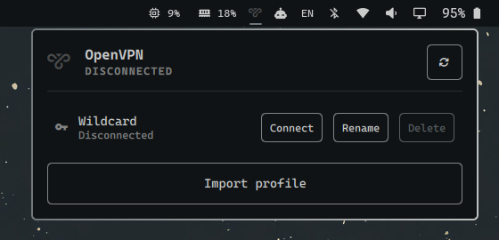
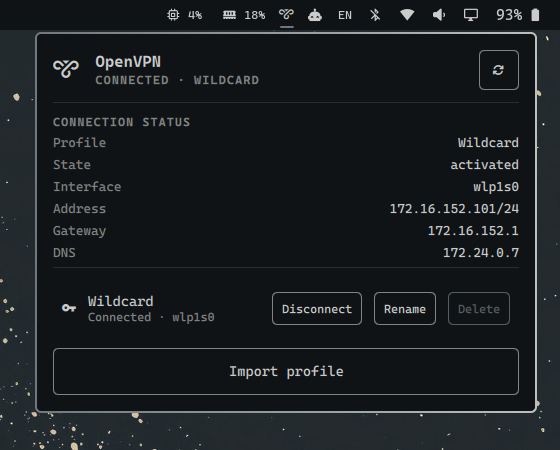

# OpenVPN for Omarchy

An Omarchy Shell bar widget for managing NetworkManager OpenVPN profiles.

The widget shows the current VPN state in the bar and provides a keyboard-aware
popup for connecting, disconnecting, importing, renaming, and deleting profiles.

## Screenshots

| Bar status                                                | Profile management                                         |
| --------------------------------------------------------- | ---------------------------------------------------------- |
|  |  |



## Features

- Shows connected, connecting, disconnected, and unavailable states
- Lists NetworkManager VPN profiles
- Connects using a username and password supplied through standard input
- Disconnects active VPN sessions
- Displays the active interface, IPv4 address, gateway, and DNS server
- Imports `.ovpn` and `.conf` profiles using Omarchy's file picker
- Renames and deletes profiles
- Supports keyboard dismissal and Omarchy panel switching
- Provides configurable profile filtering and refresh intervals

## Requirements

- NetworkManager and `nmcli`
- NetworkManager's OpenVPN plugin (`networkmanager-openvpn` on Arch Linux)

## Installation

Install and enable the plugin directly from its Git repository:

```bash
omarchy plugin add https://github.com/dstankovd/omarchy-openvpn.git --enable
```

The widget uses the manifest's default right-side placement. To put it at a
specific position instead, move it after installation—for example:

```bash
omarchy bar move dimitar.openvpn --before omarchy.agents
```

Saved plugin changes are normally reloaded automatically. If the widget does
not appear, restart the shell:

```bash
omarchy restart shell
```

Omarchy can subsequently update or remove the git-managed plugin with
`omarchy plugin update dimitar.openvpn` and
`omarchy plugin remove dimitar.openvpn`.

## Usage

Left-click the VPN icon to open the panel.

- Select **Connect** and enter the credentials required by the profile.
- Select **Disconnect** to stop an active connection.
- Use **Rename** or **Delete** to manage an existing profile.
- Select **Import profile** to import an OpenVPN configuration through the
  Omarchy file picker.
- Press `R` while the panel has focus to refresh it.
- Press `Escape` to close the panel or credential dialog.

## Configuration

Widget settings are stored in the widget's entry in
`~/.config/omarchy/shell.json`.

| Setting              | Default | Description                                                     |
| -------------------- | ------: | --------------------------------------------------------------- |
| `connection`         |   Empty | Exact profile name to display. Empty displays all VPN profiles. |
| `refreshIntervalSec` |     `5` | Status refresh interval, clamped between 2 and 300 seconds.     |

Settings can be changed with Omarchy's bar command:

```bash
omarchy bar set dimitar.openvpn refreshIntervalSec 10
omarchy bar set dimitar.openvpn connection "Work VPN"
```

## Credential and connection behavior

Passwords are passed to the bundled connection helper over standard input and
then to `nmcli` through its password-file input. They are not written to disk or
placed in command-line arguments. The supplied username is saved in the
NetworkManager connection profile.

When switching profiles, the plugin disconnects other active VPN connections
before activating the selected profile. If the new connection fails, the old
VPN is not restored automatically. Users who require continuous VPN coverage
should account for this non-atomic switch behavior.

Imported VPN profiles can change routes and DNS configuration. Only import
profiles from sources you trust.

## License

Licensed under the [MIT License](LICENSE).
